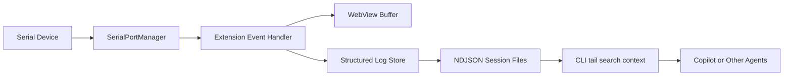

# Agent Log CLI Proposal

## Goal

Enable GitHub Copilot and other agents to directly consume serial logs from this project for debugging and triage, without competing with the VS Code extension for COM port ownership.

The primary user value is:

1. Read recent serial logs quickly.
2. Search logs by keyword or regex.
3. Extract context around suspicious log lines.
4. Let agents help diagnose resets, panics, state transitions, and intermittent failures.

## Recommended Approach

Recommended solution:

`VS Code extension keeps owning the serial port + extension writes structured log files + CLI reads those files for tail/search/context`

This is the preferred approach because it fits the current architecture with minimal risk.

## Why This Approach

Current data flow already exists:

1. The extension owns the serial connection.
2. Serial data is emitted from `SerialPortManager`.
3. The extension forwards data into the WebView buffer.

Relevant code paths:

1. [src/extension.ts](/home/hanzj/workspace/active-ailab/wsl-serial-monitor/src/extension.ts#L162)
2. [src/serialMonitorView.ts](/home/hanzj/workspace/active-ailab/wsl-serial-monitor/src/serialMonitorView.ts#L275)
3. [src/extension.ts](/home/hanzj/workspace/active-ailab/wsl-serial-monitor/src/extension.ts#L340)

If a new CLI also tries to open the same COM port directly, it will likely conflict with the extension and trigger access denied errors.

By contrast, a read-only CLI that consumes structured log files provides most of the debugging value without changing serial ownership.

## Non-Goals For MVP

The first version should not try to solve everything.

Do not include these in MVP:

1. A second process directly opening the serial port.
2. A shared daemon process.
3. A local HTTP service.
4. MCP server integration.
5. Multi-client real-time serial port multiplexing.

These can be revisited later if the basic CLI proves useful.

## MVP Scope

### 1. Structured Log Persistence

Add a log store in the extension that writes serial output into session files while the extension is running.

Suggested format: `ndjson`

Each line should be a JSON object. Example:

```json
{"ts":"2026-06-11T10:12:33.123Z","sessionId":"20260611_101200_COM7","port":"COM7","baudRate":115200,"source":"serial","text":"boot ok","raw":"626f6f74206f6b"}
{"ts":"2026-06-11T10:12:33.456Z","sessionId":"20260611_101200_COM7","port":"COM7","baudRate":115200,"source":"serial","text":"panic: foo","raw":"70616e69633a20666f6f"}
```

Suggested storage layout:

```text
logs/
  20260611_101200_COM7.ndjson
  20260611_143500_COM9.ndjson
```

### 2. Read-Only CLI

Add a CLI that reads the persisted log sessions and supports:

1. `tail`
2. `search`
3. `context`

Suggested commands:

```bash
wsl-serial-monitor logs tail --session latest
wsl-serial-monitor logs search --session latest --query "panic|error|assert" --regex
wsl-serial-monitor logs context --session latest --query "watchdog" --before 30 --after 80
```

### 3. Agent-Friendly Output

The CLI should support both human-readable and machine-readable output.

Suggested flags:

1. `--json`
2. `--limit`
3. `--before`
4. `--after`
5. `--regex`
6. `--session latest`

This makes the CLI easy to use from GitHub Copilot, Claude Code, shell scripts, and future MCP wrappers.

## Proposed Architecture



## Suggested Internal Components

### `src/logStore.ts`

Responsibilities:

1. Create a session when a port is opened.
2. Append serial log events to an `ndjson` file.
3. Maintain a small in-memory ring buffer for recent context if needed.
4. Expose helpers for reading recent lines, searching, and extracting context.

### `src/cli.ts`

Responsibilities:

1. Parse CLI args.
2. Discover available sessions.
3. Tail a session file.
4. Search within a session file.
5. Emit context around matches.

### Extension integration

Minimal integration points:

1. On serial connect: start a new log session.
2. On serial data: append to log store.
3. On serial disconnect: close the current session cleanly.

## Why Not Start With A Daemon

A daemon is a valid long-term direction, but it is not the best first step.

Reasons to defer it:

1. It introduces process lifecycle complexity.
2. It requires redesigning serial ownership.
3. It increases debugging burden before core value is proven.
4. The first user problem is log access, not multi-client port sharing.

The MVP should optimize for time-to-value rather than architecture purity.

## Why Not Let The CLI Open The Port Directly

This is the wrong direction for the current project.

Problems:

1. It can conflict with the extension's existing serial session.
2. It duplicates connection logic.
3. It increases failure cases around `access denied` and cleanup.
4. It provides little additional value compared with reading structured logs.

## Command Design Notes

### `logs tail`

Purpose:

1. Show the latest log lines.
2. Optionally follow new appended lines.

Examples:

```bash
wsl-serial-monitor logs tail --session latest --lines 100
wsl-serial-monitor logs tail --session latest --follow
```

### `logs search`

Purpose:

1. Search by plain text or regex.
2. Return matching lines with timestamps.

Examples:

```bash
wsl-serial-monitor logs search --session latest --query panic
wsl-serial-monitor logs search --session latest --query "panic|error|reset" --regex --json
```

### `logs context`

Purpose:

1. Find a match.
2. Return surrounding lines before and after that match.

Examples:

```bash
wsl-serial-monitor logs context --session latest --query watchdog --before 20 --after 50
wsl-serial-monitor logs context --session latest --query "assert|panic" --regex --limit 3
```

## Output Strategy

Recommended defaults:

1. Human-readable text by default.
2. `--json` for agents and scripts.

Human-readable output is good for engineers.
Structured JSON output is good for tools.

## Session Model

Treat each serial connection as one session.

Suggested session metadata:

1. Session ID
2. Start time
3. Port name
4. Baud rate
5. Stop time
6. File path

This enables commands like:

```bash
wsl-serial-monitor logs sessions
wsl-serial-monitor logs tail --session latest
wsl-serial-monitor logs search --session 20260611_101200_COM7 --query error
```

## Implementation Order

Recommended execution order:

1. Add `LogStore` and session file creation.
2. Write serial events to `ndjson` on every incoming data chunk.
3. Add a minimal CLI with `tail`, `search`, and `context`.
4. Add session discovery.
5. Add `--json` output.
6. Optionally add an export command for curated debug bundles.

## Success Criteria

The MVP is successful if:

1. The extension can run normally without serial ownership changes.
2. A log session file is created automatically while monitoring.
3. The CLI can show recent logs.
4. The CLI can search for known error patterns.
5. The CLI can return useful surrounding context for agent-assisted debugging.

## Future Evolution

Only after the MVP proves useful should the project consider:

1. A daemon that owns the serial port.
2. An HTTP or socket API.
3. MCP server integration.
4. SQLite or FTS indexing for large log history.
5. Automatic anomaly tagging such as `panic`, `reset`, `disconnect`, `assert`, and `watchdog`.

## Final Recommendation

Recommended path:

1. Keep serial ownership inside the VS Code extension.
2. Persist logs as structured `ndjson` session files.
3. Build a read-only CLI for `tail`, `search`, and `context`.
4. Let agents consume the CLI or files directly.

This path delivers most of the value with the lowest architectural and operational risk.